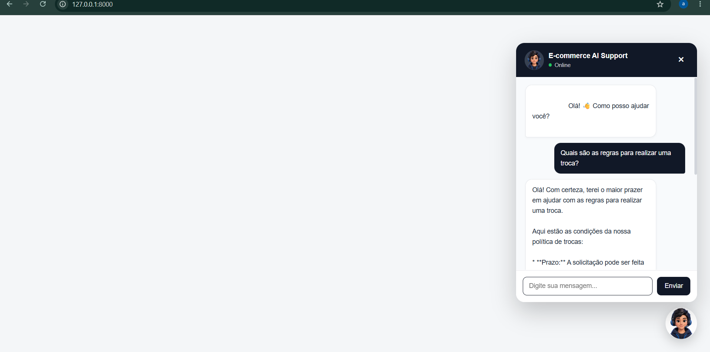
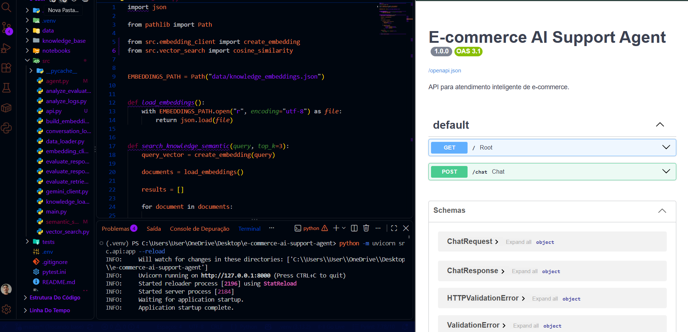
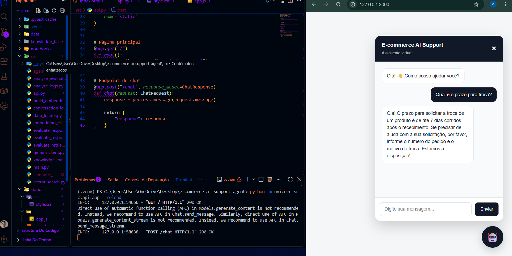

# E-commerce AI Support Agent

Agente inteligente de atendimento para e-commerce desenvolvido em Python, utilizando Large Language Models (LLMs), embeddings, busca semântica, RAG (Retrieval-Augmented Generation) e uma interface web integrada através de FastAPI.

O projeto simula um agente de suporte capaz de responder dúvidas de clientes, consultar pedidos e utilizar uma base de conhecimento para gerar respostas contextualizadas.

A aplicação evoluiu de um agente executado via terminal para uma aplicação web completa, com API REST, interface de chat, indicador de digitação, status do agente e design responsivo.

## Objetivo

O objetivo do projeto é explorar, de forma prática, conceitos relacionados a:

* Large Language Models (LLMs)
* Agentes de IA
* RAG (Retrieval-Augmented Generation)
* Embeddings
* Busca semântica
* Similaridade por cosseno
* APIs com FastAPI
* Desenvolvimento de interfaces web
* Processamento e análise de dados
* Avaliação de sistemas baseados em LLMs
* Testes automatizados

## Arquitetura

A aplicação segue o fluxo:

```text
                    Interface Web
                         │
                         ▼
                 ┌───────────────┐
                 │    FastAPI    │
                 │   POST /chat  │
                 └───────┬───────┘
                         │
                         ▼
                  ┌─────────────┐
                  │ AI Agent    │
                  └──────┬──────┘
                         │
             ┌───────────┴───────────┐
             │                       │
             ▼                       ▼
       Consulta de pedidos      Busca semântica
                                     │
                                     ▼
                              Base de conhecimento
                                     │
                                     ▼
                                    RAG
                                     │
                                     ▼
                                  Gemini
                                     │
                                     ▼
                                  Resposta
```

## V1 — AI Agent

A primeira versão do projeto foi desenvolvida com foco na construção do agente e na exploração prática de LLMs, embeddings, busca semântica e RAG.

A V1 possui:

* Integração com Google Gemini
* Consulta de pedidos
* Base de conhecimento
* Geração de embeddings
* Busca semântica
* RAG
* Registro das conversas
* Avaliação do retrieval
* Avaliação das respostas
* Análise dos logs
* Testes automatizados com pytest

## V2 — Web Application

Na segunda versão, o agente foi transformado em uma aplicação web.

Foram adicionados:

* API desenvolvida com FastAPI
* Endpoint `POST /chat`
* Interface de chat
* Botão flutuante com avatar do agente
* Janela de atendimento
* Indicador de digitação animado
* Indicador de status online
* Animações de entrada das mensagens
* Interface responsiva para dispositivos móveis
* Favicon
* Separação entre HTML, CSS e JavaScript

A interface web se comunica diretamente com o agente através da API.

## Funcionalidades

### Atendimento com LLM

O agente utiliza o modelo Gemini para gerar respostas em linguagem natural.

As respostas são orientadas pelo contexto recuperado da base de conhecimento ou pelos dados encontrados no sistema de pedidos.

### Consulta de pedidos

O sistema permite consultar pedidos a partir do número informado pelo cliente.

Exemplo:

```text
Cliente: Onde está meu pedido?

Agente: Claro! Para consultar seu pedido, poderia me informar o número do pedido?

Cliente: 1001
```

Os dados dos pedidos são armazenados em:

```text
data/orders.csv
```

e carregados utilizando Pandas.

### Base de conhecimento

O projeto possui uma base de conhecimento contendo informações sobre:

* Entrega
* Trocas de produtos

Os documentos estão armazenados no diretório:

```text
knowledge_base/
```

### Busca semântica

Os documentos da base de conhecimento são transformados em embeddings.

Para uma nova pergunta:

1. A pergunta é transformada em embedding.
2. O sistema calcula a similaridade entre a pergunta e os documentos.
3. Os documentos são ordenados por relevância.
4. Um limiar mínimo de similaridade é utilizado para evitar recuperação de conteúdo pouco relevante.
5. O contexto mais relevante é enviado ao LLM.

A implementação utiliza similaridade por cosseno para comparar os embeddings.

### RAG

O contexto recuperado pela busca semântica é utilizado para orientar a resposta do Gemini.

O agente recebe instruções para utilizar somente as informações presentes no contexto recuperado e evitar a criação de políticas, prazos ou procedimentos que não estejam na base de conhecimento.

Esse fluxo ajuda a reduzir respostas não fundamentadas nas informações disponíveis no sistema.

### Registro das conversas

As interações são armazenadas em:

```text
data/conversation_logs.csv
```

Os registros incluem informações como:

* Pergunta do usuário
* Resposta do agente
* Fonte recuperada
* Score de relevância
* Timestamp

### Análise dos logs

O projeto possui uma rotina de análise utilizando Pandas para obter métricas sobre as interações registradas.

Entre as métricas analisadas estão:

* Número total de interações
* Taxa de recuperação de contexto
* Similaridade média
* Similaridade mínima e máxima
* Distribuição das fontes recuperadas

## Interface Web

A interface foi desenvolvida com HTML, CSS e JavaScript, sendo servida pelo FastAPI.

Principais características:

* Chat flutuante
* Avatar personalizado do agente
* Status online
* Indicador de digitação
* Mensagens diferenciadas entre usuário e agente
* Animações sutis
* Layout responsivo
* Integração com a API `/chat`

### Screenshots

> As imagens abaixo apresentam a aplicação funcionando em diferentes etapas da V2.

### Interface do agente

Interface do E-commerce AI Support Agent



### RAG e API

Interface web do agente de atendimento com avatar, status online e chat integrado ao backend.



### Código e agente

Integração entre a lógica do agente, busca semântica e geração de respostas com LLM.



## Avaliação

O projeto possui um conjunto inicial de 10 perguntas para avaliar o comportamento da busca semântica e das respostas.

A avaliação de recuperação apresentou:

* 10/10 perguntas com a fonte esperada recuperada
* 4/4 consultas relacionadas a entrega
* 4/4 consultas relacionadas a trocas
* 2/2 consultas fora do escopo corretamente identificadas

As respostas também foram avaliadas utilizando critérios definidos para cada categoria.

Nesse conjunto inicial:

* 100% das respostas foram não vazias
* 100% de cobertura dos critérios definidos
* 100% de comportamento esperado nas consultas fora do escopo

> **Observação:** os resultados acima correspondem a um conjunto inicial de 10 consultas e a critérios específicos de avaliação. Eles não representam uma medida geral de precisão ou qualidade do sistema.

Os resultados das avaliações são armazenados em:

```text
data/retrieval_evaluation_results.csv
data/response_evaluation_results.csv
data/response_quality_results.csv
```

## Testes automatizados

O projeto utiliza `pytest` para testar componentes importantes da aplicação.

Atualmente existem 8 testes automatizados:

* 2 testes para carregamento e consulta de pedidos
* 3 testes para busca semântica
* 3 testes para o agente

Execução:

```powershell
python -m pytest
```

Resultado atual:

```text
8 passed
```

## Tecnologias

* Python 3.13
* Google Gemini
* Google GenAI
* FastAPI
* Uvicorn
* Pandas
* NumPy
* pytest
* HTML
* CSS
* JavaScript
* Embeddings
* RAG
* Git
* GitHub

## Estrutura do projeto

```text
e-commerce-ai-support-agent/
│
├── data/
│   ├── orders.csv
│   ├── knowledge_embeddings.json
│   ├── conversation_logs.csv
│   ├── evaluation_dataset.csv
│   ├── retrieval_evaluation_results.csv
│   ├── response_evaluation_results.csv
│   └── response_quality_results.csv
│
├── knowledge_base/
│   ├── entrega.txt
│   └── trocas.txt
│
├── src/
│   ├── agent.py
│   ├── analyze_evaluation.py
│   ├── analyze_logs.py
│   ├── api.py
│   ├── conversation_logger.py
│   ├── data_loader.py
│   ├── embedding_client.py
│   ├── evaluate_response_quality.py
│   ├── evaluate_responses.py
│   ├── evaluate_retrieval.py
│   ├── gemini_client.py
│   ├── list_models.py
│   ├── main.py
│   ├── semantic_search.py
│   └── vector_search.py
│
├── static/
│   ├── assets/
│   │   └── avatar.png
│   │
│   ├── css/
│   │   └── style.css
│   │
│   ├── js/
│   │   └── app.js
│   │
│   └── index.html
│
├── tests/
│   ├── test_agent.py
│   ├── test_data_loader.py
│   └── test_semantic_search.py
│
├── .gitignore
├── pytest.ini
├── requirements.txt
└── README.md
```

## Como executar

### 1. Clonar o repositório

```bash
git clone https://github.com/DantasDeveloperr/e-commerce-ai-support-agent.git

cd e-commerce-ai-support-agent
```

### 2. Criar e ativar o ambiente virtual

No Windows PowerShell:

```powershell
python -m venv .venv

.\.venv\Scripts\Activate.ps1
```

### 3. Instalar as dependências

```powershell
python -m pip install -r requirements.txt
```

### 4. Configurar a API do Gemini

Crie um arquivo `.env` na raiz do projeto:

```env
GEMINI_API_KEY=sua_chave_aqui
```

A chave não deve ser adicionada ao Git.

### 5. Executar o agente via terminal

```powershell
python src/main.py
```

### 6. Executar a aplicação web

```powershell
python -m uvicorn src.api:app --reload
```

A aplicação estará disponível em:

```text
http://127.0.0.1:8000/
```

A documentação interativa da API pode ser acessada em:

```text
http://127.0.0.1:8000/docs
```

### 7. Executar os testes

```powershell
python -m pytest
```

## Próximos passos

Possíveis evoluções do projeto:

* Melhorar a estratégia de avaliação das respostas
* Utilizar mocks para evitar chamadas reais ao LLM durante testes automatizados
* Expandir a base de conhecimento
* Melhorar o gerenciamento de contexto da conversa
* Adicionar novas ferramentas ao agente
* Implementar memória de conversação
* Explorar arquiteturas multiagente
* Adicionar observabilidade e métricas da aplicação
* Explorar armazenamento vetorial especializado
* Melhorar mecanismos de segurança e controle das respostas

## Status

🚀 **V2 funcional**

O projeto atualmente possui:

* Integração com LLM
* Consulta de pedidos
* Embeddings
* Busca semântica
* RAG
* Registro de conversas
* Avaliação do retrieval e das respostas
* Testes automatizados
* API com FastAPI
* Interface web
* Chat integrado ao agente
* Avatar personalizado
* Indicador de digitação
* Status online
* Design responsivo

O projeto continua em desenvolvimento como laboratório prático para estudo e aplicação de conceitos relacionados a **LLMs, agentes de IA, RAG, busca semântica, APIs e desenvolvimento de aplicações inteligentes**.
